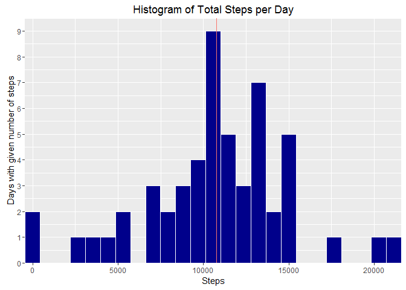
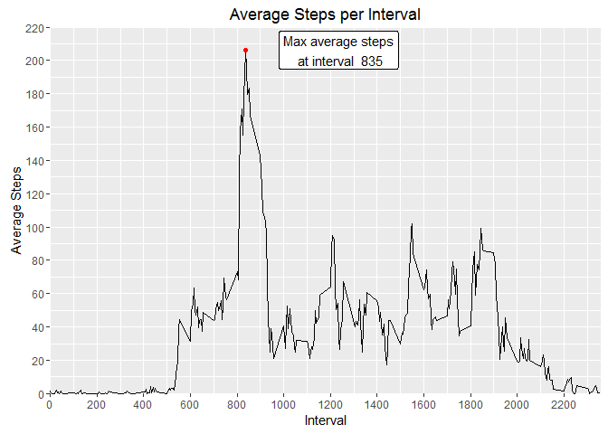
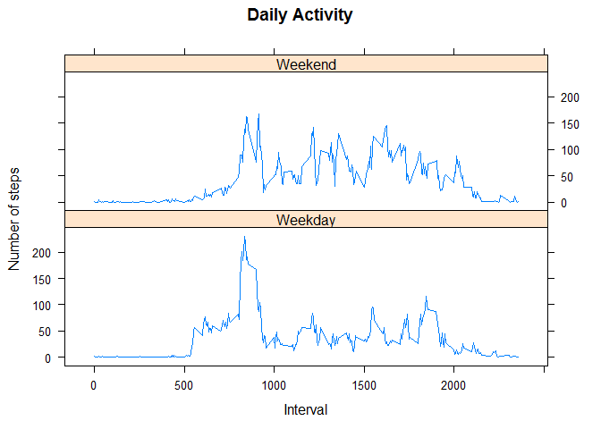

# Reproducible Research: Peer Assessment 1
Paul Kavitz  
September 22, 2016  

*******
## Loading and preprocessing the data
Code for reading in the dataset and/or preprocessing the data.   
**NOTE**: Since GitHub reposityory also contains the dataset for the assignment, this code does not download the data separately.


```r
library(dplyr)       ## load necessary libraries
library(lubridate)
library(ggplot2)
library(lattice)
options(scipen=999)  ## Suppress scientific notation
```


```r
if (file.exists("activity.zip")) {
    unzip("activity.zip")
} else {
    stop("Zip file not found.")
}

if (file.exists("activity.csv")) {
    activity <- read.csv("activity.csv", stringsAsFactors = FALSE)
    activity <- mutate(activity, date=ymd(date))
} else {
    stop("Data not found.")
}
```

*******
## What is mean total number of steps taken per day?


```r
dailytotal <- aggregate(steps~date, activity, sum)
mediansteps <- median(dailytotal$steps)
meansteps <- mean(dailytotal$steps)

dailyhist <- ggplot(dailytotal, aes(x=steps)) +
    xlab("Steps") + ylab("Days with given number of steps") +
    geom_histogram(bins=25, col="white", fill="darkblue") +
    ggtitle("Histogram of Total Steps per Day") +
    geom_vline(aes(xintercept=mediansteps, col="red"), show.legend=FALSE) +
    scale_x_continuous(expand = c(0,0)) +
    scale_y_continuous(expand = c(0,0), limit = c(0,9.5),
                       breaks = seq(from =0, to=9.5, by=1))
print(dailyhist)
```

<!-- -->

Over the period of evaluation, the subject's median steps per day was **10765** and the mean steps per day was **10766.19**.

*******
## What is the average daily activity pattern?
1. Make a time series plot (i.e. type="l") of the 5-minute interval (x-axis) and the average number of steps taken, averaged across all days (y-axis)
2. Which 5-minute interval, on average across all days in the dataset, contains the maximum number of steps?


```r
intmean <- aggregate(steps~interval, activity, mean)
maxavgsteps <- max(intmean$steps)
maxavginterval <- intmean[which.max(intmean$steps), "interval"]
maxlabel <- paste("Max average steps\n at interval ", maxavginterval)

dailypattern <- ggplot(intmean,
                       aes(x=interval, y=steps)) +
    geom_line() +
    geom_point(x=maxavginterval, y=maxavgsteps, col="red") +
    geom_label(x=maxavginterval+400, y=maxavgsteps, col="black",
               aes(label=maxlabel)) +
    xlab("Interval") + ylab("Average Steps") +
    scale_x_continuous(breaks=seq(from=0, to=2400 , by = 200),
                       expand = c(0,0), limit=c(0, 2360)) +
    scale_y_continuous(breaks=seq(from=0, to=240, by = 20),
                       expand = c(0,0), limit=c(0,220)) +
    ggtitle("Average Steps per Interval")
print(dailypattern)
```

<!-- -->

The maximum average steps occur at interval **835**.

*******
## Imputing missing values
Missing values (observations where steps=NA) are replaced with the rounded interval step mean for the entire observation period.  This code also differentiates between weekend and weekday dates in new variable *'weekperiod'*.

```r
missingsteps <- sum(is.na(activity$steps))   ## Count # of NAs
impactivity <- activity

for (i in 1:nrow(impactivity))
{
    if (is.na(impactivity[i,"steps"])) {
        impactivity[i,"steps"] <-
            round(intmean[intmean$interval==impactivity[i,"interval"],"steps"])
    }
    next
}
```
A total of **2304** observations from the raw activity dataset have missing values (coded as NA).

The new dataset *'impactivity'* contains the imputed steps.

```r
head(impactivity)
```

```
##   steps       date interval
## 1     2 2012-10-01        0
## 2     0 2012-10-01        5
## 3     0 2012-10-01       10
## 4     0 2012-10-01       15
## 5     0 2012-10-01       20
## 6     2 2012-10-01       25
```

The revised histogram including imputed activity follows:

```r
imputedtotal <- aggregate(steps~date, impactivity, sum)
imputedmedian <- median(imputedtotal$steps)
imputedmean <- mean(imputedtotal$steps)

imputedhist <- ggplot(dailytotal, aes(x=steps)) +
    xlab("Steps") + ylab("Days with given number of steps") +
    geom_histogram(bins=25, col="white", fill="darkblue") +
    ggtitle("Histogram of Total Steps per Day") +
    geom_vline(aes(xintercept=imputedmedian, col="red"), show.legend=FALSE) +
    scale_x_continuous(expand = c(0,0)) +
    scale_y_continuous(expand = c(0,0), limit = c(0,9.5),
                       breaks = seq(from =0, to=9.5, by=1))
print(imputedhist)
```

<!-- -->

Over the period of evaluation using imputed values, the subject's median steps per day was **10762** and the mean steps per day was **10765.64**.

*******
## Are there differences in activity patterns between weekdays and weekends?

The code for differentiating between weekday and weekend observations is included here.  While this would have been more efficient to perform during the imputation loop above, it is replicated here (inefficiently) to colocate code chunks with functional requirements of the assignment.

```r
## Function for determining whether date is a weekday or weekend
calcperiod <- function (d) {
    if (weekdays(d) %in% c("Saturday", "Sunday")) {
        return("Weekend")
    } else {
        return("Weekday")
    }
}
for (i in 1:nrow(impactivity))
{
    impactivity[i,"weekperiod"] <- calcperiod(impactivity[i,"date"])
    next
}
## Use imputed dataset to contrast weekday and weekend activity pattern
impactivity <- mutate(impactivity, weekperiod=factor(weekperiod))
intmean2 <- aggregate(steps~interval+weekperiod, impactivity, mean)

## Plot to contrast daily activity pattern between weekday and weekend
par(mfcol = c(1,2))  ## Create canvas for two plots.
print(xyplot(steps~interval | weekperiod, intmean2, layout=c(1,2), type="l",
             xlab="Interval", ylab="Number of steps",
             main="Daily Activity"))
```

<!-- -->

